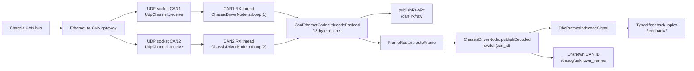
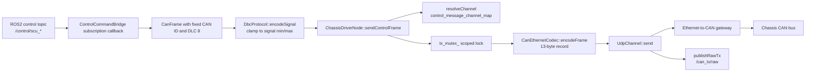

# Yunle Chassis Project Analysis

> Scope: project analysis and persistent context for ROS2 / C++ / CAN-over-Ethernet chassis-driver changes. The protocol mapping is currently aligned with `Yunle_CAN_release.dbc`.

## 1. One-line Summary

This repository is a ROS2 Humble-style C++17 chassis driver workspace with a custom interface package and one UDP CAN-over-Ethernet driver node that hardcodes DBC signal encode/decode logic in C++.

## 2. Repository Layout

```text
yunle_chassis/
  chassis_interfaces/          # ROS2 custom message package
    msg/                       # CanFrame, control commands, feedback messages
    CMakeLists.txt             # rosidl_generate_interfaces for all .msg files
    package.xml                # ament_cmake interface package metadata
  chassis_driver/              # ROS2 C++ driver package
    include/chassis_driver/    # node, UDP, codec, DBC, routing declarations
    src/                       # node implementation, UDP socket I/O, codec, DBC maps
    launch/                    # starts chassis_driver_node with YAML parameters
    config/                    # unified node/network/topic/channel parameters
    CMakeLists.txt             # builds chassis_driver_node executable
    package.xml                # rclcpp/std_msgs/builtin_interfaces/chassis_interfaces deps
  Yunle_CAN_release.dbc        # source DBC reference; runtime code does not parse it
  Yunle_CAN_release.ini        # DBC editor/view metadata; not used by runtime code
  README.md                    # run/build/topic overview
  docs/repo_analysis.md        # older analysis document; some text is mojibake
```

Package model: this is a multi-package ROS2 workspace, not a single-package repository. The two packages are `chassis_interfaces` and `chassis_driver`.

Build system and language:

- `chassis_interfaces`: `ament_cmake` + `rosidl_default_generators`; defines `.msg` interfaces.
- `chassis_driver`: `ament_cmake`, C++17, ordinary `rclcpp::Node`.
- ROS2 distribution: explicitly described as Humble in `README.md` and `chassis_driver/package.xml`; this is inferred from documentation and package metadata, not from a runtime check.

## 3. Key Files Checked

- `package.xml` and `CMakeLists.txt` in both packages.
- `chassis_driver/launch/chassis_driver.launch.py`.
- `chassis_driver/config/chassis_driver.yaml`.
- All files under `chassis_interfaces/msg/`.
- All headers and sources under `chassis_driver/include/chassis_driver/` and `chassis_driver/src/`.
- `README.md`, `docs/repo_analysis.md`, and `Yunle_CAN_release.dbc`.

## 4. Core Node and Runtime Entry Points

Main executable:

- Target: `chassis_driver_node`.
- Defined in `chassis_driver/CMakeLists.txt:19`.
- Source entry: `chassis_driver/src/main.cpp:6`.
- Node construction: `auto node = std::make_shared<chassis_driver::ChassisDriverNode>();` in `main.cpp:9`.
- Executor: `rclcpp::spin(node)` in `main.cpp:10`, so this is a normal single-node process using the default spin path. No explicit `MultiThreadedExecutor` appears in the source.

Keyboard helper executable:

- Target: `keyboard_scu_control_node`.
- Source entry: `chassis_driver/src/keyboard_scu_control_node.cpp`.
- Purpose: reads terminal key presses and publishes `chassis_interfaces/msg/ScuControlCommand` to `/yunle_chassis/control/scu_control_command`.
- Launch: `chassis_driver/launch/keyboard_scu_control.launch.py`.
- Recommended interactive command: `ros2 run chassis_driver keyboard_scu_control_node`, because launch frontends may not attach stdin in every terminal setup.
- Default command state is N gear, zero speed, zero steering, brake disabled, lights disabled, `scu_torque_or_speed_mode=0`, `steering_angle_speed_valid=false`, and `brake_force_command_valid=false`.
- This helper is independent from the CAN-over-Ethernet driver node; it does not access UDP sockets directly.

Node class:

- `ChassisDriverNode` derives from `rclcpp::Node` in `chassis_driver/include/chassis_driver/chassis_driver_node.hpp`.
- Constructor uses node name `chassis_driver_node` in `chassis_driver/src/chassis_driver_node.cpp:46`.
- It loads parameters, creates publishers, initializes UDP channels, creates router/bridge helpers, and starts RX threads.

Launch:

- `chassis_driver/launch/chassis_driver.launch.py` starts package `chassis_driver`, executable `chassis_driver_node`, name `chassis_driver_node`.
- Parameters are loaded from the installed share path `config/chassis_driver.yaml`.

Node type:

- Ordinary `rclcpp::Node`.
- No lifecycle node, component registration, Python runtime node, service, action, callback group, or timer is present in the inspected source.

Threads:

- Two independent RX threads are created in `ChassisDriverNode::startThreads()`:
  - `can1_rx_thread_ = std::thread([this]() { rxLoop(1); });`
  - `can2_rx_thread_ = std::thread([this]() { rxLoop(2); });`
- RX loops call blocking `UdpChannel::receive()`, but socket receive timeout is configured with `SO_RCVTIMEO`, default 200 ms.
- TX path is called from ROS subscription callbacks and guarded by `tx_mutex_`.

## 5. Parameters

Declared in `ChassisDriverNode::loadParameters()` in `chassis_driver/src/chassis_driver_node.cpp:106-164`; configured in `chassis_driver/config/chassis_driver.yaml`.

| Parameter | Default / YAML value | Purpose |
|---|---:|---|
| `topic_prefix` | `/yunle_chassis` | Prefix for all driver topics. |
| `publish_raw_can` | `true` | Enables raw RX/TX CAN frame topics. |
| `publish_unknown_frames` | `true` | Enables unknown-frame debug publishing. |
| `enable_debug_topics` | `true` | Enables debug publishers. |
| `log_control_can_frames` | `false` | Logs each successfully transmitted control CAN frame as hexadecimal text. This is independent from `/can_tx/raw`. |
| `default_qos_depth` | `10` | QoS queue depth for publishers/subscribers. |
| `enabled_publish_topics` | `["all"]` | Fine-grained publisher enable list. |
| `enabled_subscribe_topics` | `["all"]` | Fine-grained subscriber enable list. |
| `message_channel_map` | all listed feedback on `can2` | Maps decoded feedback message names to CAN channel. Currently loaded but not used to filter RX frames. |
| `control_message_channel_map` | all listed control/debug messages on `can2` | Maps outgoing control/debug CAN message names to CAN channel; required for SCU commands plus `VCU_Debug_Enable` and `VCU_Drive_Debug`. |
| `local_ip` | `192.168.1.102` | Local bind IP for UDP sockets. |
| `can1_local_port` | `8234` | Local UDP port for CAN1. |
| `can2_local_port` | `8235` | Local UDP port for CAN2. |
| `can1_remote_ip` | `192.168.1.98` | Remote CAN1 gateway IP. |
| `can2_remote_ip` | `192.168.1.99` | Remote CAN2 gateway IP. |
| `remote_port` | `1234` | Remote UDP destination port. |
| `udp_buffer_size` | `2048` | Receive buffer size. |
| `socket_timeout_ms` | `200` | UDP receive timeout. |
| `scu_control_max_steering_angle_deg` | `27.0` | 0x121 wrapper parameter: physical maximum steering angle used to convert `/control/scu_control_command` front/rear steering degrees to 8-bit two's-complement raw. |
| `scu_control_max_target_speed_kmh` | `15.0` | 0x121 wrapper parameter: allowed target speed range is `[0, max]`; values outside the range are logged and sent as 0. |

## 6. ROS2 Interfaces

### Published Topics

All topic names below assume default `topic_prefix=/yunle_chassis`.

| Topic | Message type | Trigger / frequency | Source | Source function |
|---|---|---|---|---|
| `/yunle_chassis/can_rx/raw` | `chassis_interfaces/msg/CanFrame` | Each decoded UDP CAN record when `publish_raw_can` is true | Raw UDP payload decoded by `CanEthernetCodec::decodePayload()` | `ChassisDriverNode::publishRawRx()` |
| `/yunle_chassis/can_tx/raw` | `chassis_interfaces/msg/CanFrame` | Each successful control-frame send when `publish_raw_can` is true | TX frame after `UdpChannel::send()` succeeds | `ChassisDriverNode::publishRawTx()` |
| `/yunle_chassis/debug/unknown_frames` | `std_msgs/msg/String` | Unknown CAN ID in `publishDecoded()` default case | Any received frame not handled by the switch | `ChassisDriverNode::publishUnknownFrame()` |
| `/yunle_chassis/feedback/bms_status` | `chassis_interfaces/msg/BmsStatus` | On received CAN ID 256 | `BMS_Status` | `ChassisDriverNode::publishDecoded()` |
| `/yunle_chassis/feedback/vcu_warning_level` | `chassis_interfaces/msg/VcuWarningLevel` | On received CAN ID 119 | `VCU_Warning_Level` | `ChassisDriverNode::publishDecoded()` |
| `/yunle_chassis/feedback/wheel_speed` | `chassis_interfaces/msg/WheelSpeedFeedback` | On received CAN ID 360 | `VCU_Wheel_Speed_Feedback` | `ChassisDriverNode::publishDecoded()` |
| `/yunle_chassis/feedback/ccu_status` | `chassis_interfaces/msg/CcuStatus` | On received CAN ID 81 | `VCU_CCU_Status` | `ChassisDriverNode::publishDecoded()` |
| `/yunle_chassis/feedback/sas_angle` | `chassis_interfaces/msg/SasAngleFeedback` | On received CAN ID 225 | `SAS_Angle_Feedback` | `ChassisDriverNode::publishDecoded()` |
| `/yunle_chassis/feedback/target_speed_feedback` | `chassis_interfaces/msg/ScuTargetSpeedFeedback` | On received CAN ID 2033 | `SCU_Target_Speed_Feedback` | `ChassisDriverNode::publishDecoded()` |

Publish frequency is not timer-based in this code. It is exactly event-driven by UDP receive rate, except TX raw which is event-driven by control-topic callbacks.

### Subscribed Topics

| Topic | Message type | Callback location | Meaning | CAN output |
|---|---|---|---|---|
| `/yunle_chassis/control/scu_control_command` | `chassis_interfaces/msg/ScuControlCommand` | Lambda in `ControlCommandBridge::ControlCommandBridge()` at `control_command_bridge.cpp:16` | Shift, steering front/rear, target speed, brake enable, light requests, mode/valid flags; CAN drive mode is fixed to 1 by the driver | CAN ID 289 `SCU_Control_Command` via `sendControlFrame()` |
| `/yunle_chassis/control/scu_chassis_command` | `chassis_interfaces/msg/ScuChassisCommand` | Lambda in `ControlCommandBridge::ControlCommandBridge()` at `control_command_bridge.cpp:41` | Steering angle speed and four brake-force commands | CAN ID 294 `SCU_Chassis_Command` via `sendControlFrame()` |
| `/yunle_chassis/control/scu_torque_command` | `chassis_interfaces/msg/ScuTorqueCommand` | Lambda in `ControlCommandBridge::ControlCommandBridge()` at `control_command_bridge.cpp:57` | Four wheel torque commands | CAN ID 291 `SCU_Torque_Command` via `sendControlFrame()` |
| `/yunle_chassis/control/vcu_chassis_debug` | `chassis_interfaces/msg/VcuChassisDebug` | Lambda in `ControlCommandBridge::ControlCommandBridge()` | Integrated chassis debug command, logical name `VCU_Chassis_Debug` | CAN IDs 1808 `VCU_Debug_Enable` and 1813 `VCU_Drive_Debug` via `sendControlFrame()` |

Helper publisher:

| Node | Publishes | Message type | Trigger | Purpose |
|---|---|---|---|---|
| `keyboard_scu_control_node` | `/yunle_chassis/control/scu_control_command` | `chassis_interfaces/msg/ScuControlCommand` | Non-blocking terminal key polling plus periodic timer | Manual keyboard control for D/R/N, target speed, steering, brake, lights, mode and valid flags |

Runtime wrapper note for `/yunle_chassis/control/scu_control_command`:

- `ScuControlCommand.scu_shift_level_request` is accepted only as `1=D`, `2=N`, or `3=R`; invalid values are rejected before CAN send.
- `SCU_Drive_Mode_Request` is no longer exposed in `ScuControlCommand`; the driver always sends `1` for this CAN signal when `/control/scu_control_command` is transmitted.
- `scu_steering_angle_front` and `scu_steering_angle_rear` are ROS-side physical degrees. Valid values in `[-scu_control_max_steering_angle_deg, +scu_control_max_steering_angle_deg]` are converted to 8-bit two's-complement raw using `raw_signed = angle_deg / max_angle_deg * 120`; non-finite or out-of-range values are logged and sent as 0.
- `scu_target_speed` is treated as a non-negative speed in km/h. Non-finite values, negative values, or values above `scu_control_max_target_speed_kmh` are logged and sent as 0.
- Detailed differences against `docs/云乐线控底盘通信协议使用说明-2026.docx` are recorded in `docs/scu_control_command_wrapper_2026.md`.

### Services and Actions

No `create_service`, service definitions, action definitions, or action clients/servers were found.

### TF / Odometry

No `nav_msgs/Odometry`, TF broadcaster, odom frame, base frame, or odometry integration logic was found. Wheel speed feedback is published as wheel RPM only; no odom topic or TF is produced by current source.

## 7. Ethernet-to-CAN Communication Link

Connection type:

- UDP socket per CAN channel.
- Implemented in `UdpChannel` using POSIX sockets: `socket(AF_INET, SOCK_DGRAM, 0)`, `bind`, `recvfrom`, and `sendto`.
- This code includes Linux/POSIX headers (`arpa/inet.h`, `sys/socket.h`, `unistd.h`); native Windows build is unlikely without a POSIX/ROS2 environment. This is an environment inference from includes, not a tested build conclusion.

Initialization:

1. `ChassisDriverNode::initializeChannels()` opens CAN1 and CAN2.
2. Each channel binds to the configured `local_ip` and local port.
3. Each channel stores a fixed remote IP and `remote_port`.
4. If either open fails, node logs fatal and throws.

Reconnect:

- No reconnect loop is implemented.
- If initialization fails, the node fails construction.
- If later `receive()` or `send()` fails, RX loops continue on receive failure and TX logs an error on send failure, but no socket reopen is attempted.

RX frame format:

- `CanEthernetCodec::decodePayload()` treats UDP payload as zero or more fixed 13-byte records.
- If payload length is not a multiple of 13, trailing bytes are dropped and a warning is logged in `rxLoop()`.
- Byte layout per 13-byte record:
  - byte 0: info flags. `0x80` means extended, `0x40` means remote, low nibble is DLC, DLC is clamped to 8.
  - bytes 1-4: CAN ID, big-endian transport order. Standard IDs are masked with `0x7FF`; extended IDs with `0x1FFFFFFF`.
  - bytes 5-12: CAN data bytes.
- There is no frame header, tail, checksum, counter, timestamp, source-address validation, or sequence check in current codec.

TX frame format:

- `CanEthernetCodec::encodeFrame()` emits one 13-byte record.
- byte 0 is `(extended ? 0x80 : 0x00) | 0x20 | dlc`; current TX frames use standard IDs and DLC 8.
- bytes 1-4 are CAN ID in big-endian transport order.
- bytes 5-12 are CAN data bytes.

CAN signal byte order:

- All signals currently hardcoded in `DbcProtocol` use `ByteOrder::Intel`.
- `DbcProtocol` also implements Motorola extraction/insertion, but no current message definition uses it.

## 8. CAN Protocol Mapping Table

All rows below are explicit in source unless marked otherwise. Signal definitions are hardcoded in `chassis_driver/src/dbc_protocol.cpp`; ROS mapping is in `ChassisDriverNode::publishDecoded()` or `ControlCommandBridge::ControlCommandBridge()`.

| CAN ID | Direction | Cycle / trigger | Source location | Function | Fields | Bits | Factor | Offset | Unit | ROS2 topic / fields | Notes |
|---:|---|---|---|---|---|---|---:|---:|---|---|---|
| 81 | RX | DBC cycle 20 ms; runtime event-driven by UDP receive | `dbc_protocol.cpp:35`, `chassis_driver_node.cpp:296` | `decodeSignal`, `publishDecoded` | `CCU_Shift_Level_Status`, `CCU_Parking_Status`, `CCU_Ignition_Status`, `CCU_Drive_Mode_Shift_Button`, `Steering_Wheel_Direction`, `CCU_Steering_Wheel_Angle`, `CCU_Vehicle_Speed`, `CCU_Drive_Mode`, `Remote_Brake_Request_Status`, `Emergency_Brake_Request_Status`, `SCU_Brake_Signal_Status`, `Touch_Brake_Request_Status`, `Handle_Brake_Request_Status`, `Handle_Mode_Flag_Status`, `Left_Turn_Light_Status`, `Right_Turn_Light_Status`, `Position_Light_Status`, `Low_Beam_Status` | `0|2`, `2|1`, `3|2`, `5|1`, `7|1`, `8|12`, `20|9`, `29|3`, `32|1`, `33|1`, `34|1`, `35|1`, `36|1`, `37|1`, `56|1`, `57|1`, `59|1`, `60|1` | mostly 1; steering/speed 0.1 | 0 | `km/h` for vehicle speed | `/feedback/ccu_status` corresponding fields | New DBC adds touch/handle brake and handle mode flags. |
| 119 | RX | DBC cycle 100 ms; runtime event-driven by UDP receive | `dbc_protocol.cpp:18`, `chassis_driver_node.cpp:271` | `decodeSignal`, `publishDecoded` | `BMS_SOC_Warning`, `MCU_Disconnect_Warning`, `MCU_Motor_Warning`, `MCU_Speed_Warning`, `Steering_Disconnect_Warning`, `Steering_Lock_Warning`, `Steering_Uncontrollable_Warning`, `Steering_Error_Warning`, `Brake_Error_Warning` | `0|3`, `3|3`, `6|3`, `9|3`, `12|3`, `15|3`, `18|3`, `21|3`, `24|3` | 1 | 0 | none | `/feedback/vcu_warning_level` | New DBC removes charge/current/temperature warning fields and adds steering/brake error warnings. |
| 225 | RX | Event-driven by UDP receive | `dbc_protocol.cpp:56`, `chassis_driver_node.cpp:321` | `decodeSignal`, `publishDecoded` | `SAS_Front_Angle`, `SAS_Rear_Angle` | `0|16`, `24|16` | 0.1 | 0 | deg | `/feedback/sas_angle` | Signed 16-bit values. Gap at bits 16-23. |
| 256 | RX | DBC cycle 100 ms; runtime event-driven by UDP receive | `dbc_protocol.cpp:13`, `chassis_driver_node.cpp:252` | `decodeSignal`, `publishDecoded` | `BMS_Voltage`, `BMS_Current`, `BMS_SOC` | `0|16`, `16|16`, `32|16` | 0.1, 0.1, 1 | 0 | V, A, % | `/feedback/bms_status` | New DBC range: voltage 0-100 V, current -500-500 A. |
| 360 | RX | DBC cycle 20 ms; runtime event-driven by UDP receive | `dbc_protocol.cpp:29`, `chassis_driver_node.cpp:286` | `decodeSignal`, `publishDecoded` | four wheel RPM fields | `0|16`, `16|16`, `32|16`, `48|16` | 0.1 | 0 | rpm | `/feedback/wheel_speed` | Signed 16-bit values. |
| 2033 | RX | DBC cycle 20 ms; runtime event-driven by UDP receive | `dbc_protocol.cpp:59`, `chassis_driver_node.cpp:328` | `decodeSignal`, `publishDecoded` | `Hardware_Target_Speed`, `SCU_Target_Speed_Feedback`, `Vehicle_Target_Speed`, `Vehicle_Target_Speed_RPM` | `0|16`, `16|16`, `32|16`, `48|16` | 0.1 | 0 | km/h, rpm | `/feedback/target_speed_feedback` | Signed 16-bit values. |
| 1808 | TX | DBC cycle 100 ms; runtime sends on `/control/vcu_chassis_debug` callback | `dbc_protocol.cpp`, `control_command_bridge.cpp` | `encodeSignal`, `sendControlFrame` | `PID_Debug_Enable` | `2|1` | 1 | 0 | none | `/control/vcu_chassis_debug.pid_debug_enable` | Integrated with CAN ID 1813 under ROS message `VcuChassisDebug`. |
| 1813 | TX | DBC cycle 100 ms; runtime sends on `/control/vcu_chassis_debug` callback | `dbc_protocol.cpp`, `control_command_bridge.cpp` | `encodeSignal`, `sendControlFrame` | `Velocity_Kp`, `Velocity_Ki`, `Velocity_Kd` | `34|10`, `44|10`, `54|10` | 0.1, 0.01, 0.01 | 0 | none | `/control/vcu_chassis_debug` gain fields | Integrated with CAN ID 1808 under ROS message `VcuChassisDebug`. |
| 289 | TX | DBC cycle 20 ms; runtime sends on `/control/scu_control_command` callback | `dbc_protocol.cpp:82`, `control_command_bridge.cpp:16` | `encodeSignal`, `sendControlFrame` | `SCU_Shift_Level_Request`, `SCU_Drive_Mode_Request`, `SCU_Steering_Angle_Front`, `SCU_Steering_Angle_Rear`, `SCU_Target_Speed`, `SCU_Brake_Enable`, light requests, mode and valid flags | `0|2`, `6|2`, `8|8`, `16|8`, `24|9`, `33|1`, `40|2`, `42|2`, `46|2`, `48|2`, `58|1`, `60|1`, `61|1` | 1 except target speed 0.1 | 0 | km/h for target speed | `/control/scu_control_command` fields | README says engineering assumption: ACU is allowed to transmit this SCU-named message; DBC has `BO_TX_BU_ 289 : ACU,SCU`. |
| 291 | TX | DBC cycle 20 ms; runtime sends on `/control/scu_torque_command` callback | `dbc_protocol.cpp:69`, `control_command_bridge.cpp:57` | `encodeSignal`, `sendControlFrame` | four torque commands | `0|16`, `16|16`, `32|16`, `48|16` | 0.1 | 0 | Nm | `/control/scu_torque_command` fields | DBC has `BO_TX_BU_ 291 : ACU,SCU`. |
| 294 | TX | DBC cycle 20 ms; runtime sends on `/control/scu_chassis_command` callback | `dbc_protocol.cpp:75`, `control_command_bridge.cpp:41` | `encodeSignal`, `sendControlFrame` | steering angle speed and four brake forces | `0|16`, `16|8`, `24|8`, `32|8`, `40|8` | 1 | 0 | deg/s, % | `/control/scu_chassis_command` fields | Steering speed min is 126, max 525; encoder clamps by default. DBC has `BO_TX_BU_ 294 : ACU,SCU`. |

DBC entries present but not implemented in C++ runtime:

- None known after the `VcuChassisDebug` integration. CAN IDs 1808 and 1813 are implemented as one ROS control message that emits two CAN frames.

Magic numbers / hardcoded protocol values:

- CAN IDs are hardcoded in `publishDecoded()` switch and `ControlCommandBridge` callbacks.
- DBC signal definitions, factors, offsets, min/max values, and units are hardcoded in `kMessageById`.
- CAN-over-Ethernet record size `13`, info flags `0x80`, `0x40`, `0x20`, ID masks `0x1FFFFFFF` and `0x7FF` are hardcoded in `CanEthernetCodec`.
- Default network values are hardcoded in `loadParameters()` and duplicated in YAML defaults.

Missing protocol metadata:

- `Yunle_CAN_release.dbc` includes `GenMsgCycleTime` attributes. Runtime publication/transmission is still event-driven by UDP input or ROS topic callbacks; no periodic TX timer is implemented.
- No source timestamp from the gateway is carried.
- No checksum, counter, or frame freshness metadata is present in the transport codec.

## 9. Feedback Data Flow



Text summary:

1. UDP packets are received independently for CAN1 and CAN2.
2. Each UDP payload is split into 13-byte CAN records.
3. Raw decoded frames may be published.
4. `FrameRouter` forwards every frame to `publishDecoded()`.
5. `publishDecoded()` switches on CAN ID and calls `DbcProtocol::decodeSignal()`.
6. Decoded fields are copied into custom ROS2 feedback messages and published.

## 10. Control Data Flow



Text summary:

1. A control topic message triggers one callback.
2. The callback creates one 8-byte `CanFrame` with a fixed CAN ID.
3. Each ROS field is encoded into CAN bits through `DbcProtocol::encodeSignal()`.
4. `encodeSignal()` clamps physical values to hardcoded DBC min/max by default.
5. `sendControlFrame()` resolves CAN1/CAN2, serializes TX with `tx_mutex_`, sends UDP, and publishes raw TX on success.

## 11. Safety and Real-time Analysis

What exists:

- Signal range clamping exists in `DbcProtocol::encodeSignal()` by default.
- Brake-related command fields exist (`SCU_Brake_Enable`, four brake-force fields, `Brake_Force_Command_Valid`).
- Emergency/remote brake feedback fields exist in `CcuStatus`.
- TX calls are protected by `tx_mutex_`.
- RX thread lifetime uses `std::atomic<bool> running_`.
- UDP receive has a configured timeout, reducing shutdown blocking risk.

What is not found:

- No command timeout protection: no timer or last-command timestamp that sends a stop/brake command when control input expires.
- No automatic parking/zero-speed command on gateway disconnect.
- No heartbeat CAN frame.
- No periodic control send loop; commands are sent only when topic callbacks arrive.
- No explicit emergency-stop command topic; only brake-related fields inside existing control messages.
- No feedback freshness checking or missing-frame detection.
- No reconnect mechanism.
- No source-address validation for incoming UDP datagrams.
- No mutex around ROS publisher calls from the two RX threads. rclcpp publisher use is generally intended to be thread-safe, but this should be confirmed for the target ROS2 distro and executor model before high-rate production use. This is a risk note, not a confirmed bug.
- The unused `/yunle_chassis/debug/status` publisher was removed; current debug output uses `/yunle_chassis/debug/unknown_frames`.

Potential real-time risks:

- Control frequency depends entirely on upstream ROS topic publish rate and callback scheduling.
- `sendto()` is called inside subscription callbacks. UDP send is usually quick, but failure/blocking behavior is not isolated in a dedicated TX thread.
- RX decode and typed publishing happen inside the two RX threads, not in ROS executor callbacks. This can be acceptable, but shared node/publisher access should be reviewed under the target ROS2 version and load.

## 12. Build and Test Commands

Attempted commands:

```powershell
git status --short --branch
colcon build --symlink-install
colcon test
```

Observed result:

- `git status --short --branch` returned `## main...origin/main`.
- `colcon build --symlink-install` failed before build because PowerShell could not find `colcon`.
- `colcon test` failed for the same reason.
- No `test/` directories were found in the repository.

Recommended build in a proper ROS2 environment:

```bash
source /opt/ros/humble/setup.bash
colcon build --symlink-install --packages-select chassis_interfaces chassis_driver
colcon test --packages-select chassis_interfaces chassis_driver
```

On Windows, use the project-supported ROS2 environment or WSL/Linux container because current `UdpChannel` uses POSIX socket headers.

## 13. Extension Guide

Add a new feedback CAN ID:

1. Add the message definition to `DbcProtocol::kMessageById` in `chassis_driver/src/dbc_protocol.cpp`.
2. Add or extend a `.msg` file in `chassis_interfaces/msg/` if a new ROS message type is needed.
3. Register new `.msg` in `chassis_interfaces/CMakeLists.txt`.
4. Add a publisher member in `ChassisDriverNode` header if needed.
5. Create the publisher in `ChassisDriverNode` constructor.
6. Add a `case` in `ChassisDriverNode::publishDecoded()` to decode fields and publish.
7. Add topic key to `enabled_publish_topics` comments/YAML.
8. Add message-to-channel entry in `message_channel_map`.
9. Update this CAN mapping table.

Add a new ROS feedback topic for an existing CAN ID:

1. Add a `.msg` if the existing message types do not fit.
2. Add publisher creation and member storage in `ChassisDriverNode`.
3. Add or adjust `publishDecoded()` mapping.
4. Update YAML topic enable keys and documentation.

Add a new control command topic:

1. Add `.msg` to `chassis_interfaces/msg/` and `CMakeLists.txt`.
2. Add subscription member to `ChassisDriverNode`.
3. Add DBC message/signals to `DbcProtocol::kMessageById` if not already present.
4. Add subscription and callback in `ControlCommandBridge::ControlCommandBridge()`.
5. Set CAN ID, DLC, and `encodeSignal()` calls in the callback.
6. Add channel mapping in `control_message_channel_map`.
7. Review clamping, timeout, brake/estop interactions, and TX raw publication.

Add a parameter:

1. Declare it in `ChassisDriverNode::loadParameters()`.
2. Read it into a member variable.
3. Add it to `chassis_driver/config/chassis_driver.yaml`.
4. If launch override behavior is needed, update `chassis_driver.launch.py`.
5. Document default, units, and safety implications.

Adapt another Ethernet-to-CAN device:

- Recommended abstraction boundary: introduce an interface around transport codec and channel I/O, for example:
  - `ICanTransport` for open/close/send/receive.
  - `ICanFrameCodec` for gateway-specific byte framing.
- Keep `DbcProtocol`, `ControlCommandBridge`, and ROS topic mapping independent from the gateway-specific transport.
- Device-specific logic should replace or wrap `UdpChannel` and `CanEthernetCodec`, not leak into `publishDecoded()` or control callbacks.

Add tests:

- Start with unit tests for `DbcProtocol::encodeSignal()` / `decodeSignal()` round trips, including min/max clamping and signed values.
- Add unit tests for `CanEthernetCodec::encodeFrame()` / `decodePayload()`, including standard ID, extended ID, DLC > 8 clamp, multi-frame payload, and trailing bytes.
- Add a lightweight node test or integration test with synthetic UDP payloads once a ROS2 test harness is available.

## 14. Current Unknowns

- Exact gateway vendor/model is not documented in source.
- Exact CAN message cycle times are not present in runtime source.
- Runtime environment and ROS2 distro were not verified because `colcon` is unavailable in this shell.
- No hardware or simulator was available to validate UDP packet framing against a real device.
- `VCU_Chassis_Debug` is a ROS-level logical integration name; the actual ROS `.msg` type is `VcuChassisDebug`. CAN-level messages still use the DBC names `VCU_Debug_Enable` and `VCU_Drive_Debug`.
- `message_channel_map` is loaded but not used to validate or route RX frames; it may be reserved for future logic.
- No AGENTS.md existed during this analysis; adding one is recommended for future agents.

## 15. Suggested AGENTS.md Draft

```markdown
# AGENTS.md

This project is a ROS2 chassis driver for a mobile robot base. It communicates with the chassis through an Ethernet-to-CAN gateway and maps CAN frames to ROS2 topics and ROS2 control topics back to CAN frames.

Before modifying code, read `docs/codex_project_analysis.md`.

When extending the CAN protocol, update the CAN protocol mapping table in `docs/codex_project_analysis.md` in the same change.

When adding a topic, parameter, CAN ID, message type, launch behavior, or gateway setting, update the relevant documentation and YAML comments.

When modifying the control path, review command clamping, command timeout behavior, emergency/brake behavior, connection-loss behavior, and thread safety.

After each code change, run `colcon build --symlink-install` and relevant tests when a ROS2 environment is available. If tests cannot be run, record the reason.

Keep transport-specific gateway framing separate from DBC signal encode/decode and ROS topic mapping.
```
