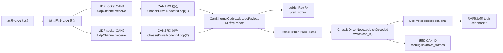
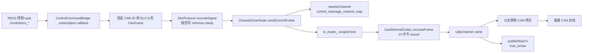

# Yunle Chassis 项目分析

> 范围：为 ROS2 / C++ / CAN-over-Ethernet 底盘驱动修改准备的项目分析和持久上下文。当前协议映射已对齐 `Yunle_CAN_release.dbc`。

## 1. 一句话概述

本仓库是一个 ROS2 Humble 风格的 C++17 底盘驱动 workspace，包含一个自定义接口包，以及一个通过 UDP CAN-over-Ethernet 与底盘通信的驱动节点；DBC 信号编解码逻辑以 C++ 硬编码形式实现。

## 2. 仓库结构

```text
yunle_chassis/
  chassis_interfaces/          # ROS2 自定义消息包
    msg/                       # CanFrame、控制命令、反馈消息
    CMakeLists.txt             # 对所有 .msg 调用 rosidl_generate_interfaces
    package.xml                # ament_cmake 接口包元数据
  chassis_driver/              # ROS2 C++ 驱动包
    include/chassis_driver/    # 节点、UDP、编解码器、DBC、路由声明
    src/                       # 节点实现、UDP socket I/O、编解码器、DBC 映射
    launch/                    # 使用 YAML 参数启动 chassis_driver_node
    config/                    # 统一的节点、网络、topic、通道参数
    CMakeLists.txt             # 构建 chassis_driver_node 可执行文件
    package.xml                # rclcpp/std_msgs/builtin_interfaces/chassis_interfaces 依赖
  Yunle_CAN_release.dbc        # DBC 源参考；运行时源码不解析该文件
  Yunle_CAN_release.ini        # DBC 编辑器/视图元数据；运行时源码不使用
  README.md                    # 构建、运行、topic 概览
  docs/repo_analysis.md        # 旧分析文档；部分文本存在乱码
```

包模型：这是一个多包 ROS2 workspace，不是单包仓库。包含两个包：`chassis_interfaces` 和 `chassis_driver`。

构建系统与语言：

- `chassis_interfaces`：`ament_cmake` + `rosidl_default_generators`，定义 `.msg` 接口。
- `chassis_driver`：`ament_cmake`，C++17，普通 `rclcpp::Node`。
- ROS2 发行版：`README.md` 和 `chassis_driver/package.xml` 明确描述为 Humble；这是基于文档和包元数据的推断，不是运行时验证结果。

## 3. 已检查的关键文件

- 两个包中的 `package.xml` 和 `CMakeLists.txt`。
- `chassis_driver/launch/chassis_driver.launch.py`。
- `chassis_driver/config/chassis_driver.yaml`。
- `chassis_interfaces/msg/` 下的全部文件。
- `chassis_driver/include/chassis_driver/` 和 `chassis_driver/src/` 下的全部头文件与源文件。
- `README.md`、`docs/repo_analysis.md` 和 `Yunle_CAN_release.dbc`。

## 4. 核心节点与运行入口

主可执行程序：

- 目标名：`chassis_driver_node`。
- 定义位置：`chassis_driver/CMakeLists.txt:19`。
- 源码入口：`chassis_driver/src/main.cpp:6`。
- 节点构造：`main.cpp:9` 中的 `auto node = std::make_shared<chassis_driver::ChassisDriverNode>();`。
- Executor：`main.cpp:10` 中调用 `rclcpp::spin(node)`，因此这是一个普通单节点进程，使用默认 spin 路径。源码中未出现显式 `MultiThreadedExecutor`。

键盘辅助控制节点：

- 目标名：`keyboard_scu_control_node`。
- 源码入口：`chassis_driver/src/keyboard_scu_control_node.cpp`。
- 作用：读取终端键盘按键，并向 `/yunle_chassis/control/scu_control_command` 发布 `chassis_interfaces/msg/ScuControlCommand`。
- Launch：`chassis_driver/launch/keyboard_scu_control.launch.py`。
- 推荐交互式运行命令：`ros2 run chassis_driver keyboard_scu_control_node`，因为某些 launch 前端不会把 stdin 连接到子进程。
- 该节点独立于以太网转 CAN 驱动节点，不直接访问 UDP socket。

节点类：

- `ChassisDriverNode` 在 `chassis_driver/include/chassis_driver/chassis_driver_node.hpp` 中继承自 `rclcpp::Node`。
- 构造函数在 `chassis_driver/src/chassis_driver_node.cpp:46` 使用节点名 `chassis_driver_node`。
- 构造流程包括加载参数、创建 publisher、初始化 UDP 通道、创建 router/bridge 辅助对象，并启动 RX 线程。

Launch：

- `chassis_driver/launch/chassis_driver.launch.py` 启动 package `chassis_driver`、executable `chassis_driver_node`，节点名为 `chassis_driver_node`。
- 参数从安装后的 share 路径 `config/chassis_driver.yaml` 加载。

节点类型：

- 普通 `rclcpp::Node`。
- 已检查源码中未发现 lifecycle node、component 注册、Python 运行节点、service、action、callback group 或 timer。

线程：

- `ChassisDriverNode::startThreads()` 创建两个独立 RX 线程：
  - `can1_rx_thread_ = std::thread([this]() { rxLoop(1); });`
  - `can2_rx_thread_ = std::thread([this]() { rxLoop(2); });`
- RX loop 调用阻塞式 `UdpChannel::receive()`，但 socket receive timeout 通过 `SO_RCVTIMEO` 配置，默认 200 ms。
- TX 路径由 ROS subscription callback 调用，并通过 `tx_mutex_` 保护。

## 5. 参数

参数在 `chassis_driver/src/chassis_driver_node.cpp:106-164` 的 `ChassisDriverNode::loadParameters()` 中声明，并在 `chassis_driver/config/chassis_driver.yaml` 中配置。

| 参数 | 默认值 / YAML 值 | 作用 |
|---|---:|---|
| `topic_prefix` | `/yunle_chassis` | 所有驱动 topic 的前缀。 |
| `publish_raw_can` | `true` | 启用原始 RX/TX CAN 帧 topic。 |
| `publish_unknown_frames` | `true` | 启用未知帧 debug 发布。 |
| `enable_debug_topics` | `true` | 启用 debug publisher。 |
| `log_control_can_frames` | `false` | 在节点日志中输出每一帧成功下发到底盘的控制 CAN 帧十六进制内容；该参数独立于 `/can_tx/raw`。 |
| `default_qos_depth` | `10` | publisher/subscriber 的 QoS 队列深度。 |
| `enabled_publish_topics` | `["all"]` | publisher 细粒度启用列表。 |
| `enabled_subscribe_topics` | `["all"]` | subscriber 细粒度启用列表。 |
| `message_channel_map` | 已列出的反馈均为 `can2` | 将解码反馈消息名映射到 CAN 通道。当前已加载，但未用于过滤 RX 帧。 |
| `control_message_channel_map` | 已列出的控制/调试消息均为 `can2` | 将下行控制/调试 CAN 消息名映射到 CAN 通道；SCU 控制报文以及 `VCU_Debug_Enable`、`VCU_Drive_Debug` 均要求存在映射。 |
| `local_ip` | `192.168.1.102` | UDP socket 本地绑定 IP。 |
| `can1_local_port` | `8234` | CAN1 本地 UDP 端口。 |
| `can2_local_port` | `8235` | CAN2 本地 UDP 端口。 |
| `can1_remote_ip` | `192.168.1.98` | CAN1 远端网关 IP。 |
| `can2_remote_ip` | `192.168.1.99` | CAN2 远端网关 IP。 |
| `remote_port` | `1234` | 远端 UDP 目标端口。 |
| `udp_buffer_size` | `2048` | 接收缓冲区大小。 |
| `socket_timeout_ms` | `200` | UDP 接收超时时间。 |
| `scu_control_max_steering_angle_deg` | `27.0` | 0x121 封装参数：车辆实际最大转角，用于将 `/control/scu_control_command` 的前/后转向角度值换算成 8 位补码 raw。 |
| `scu_control_max_target_speed_kmh` | `15.0` | 0x121 封装参数：允许的目标速度范围为 `[0, max]`；超出范围的值会记录 warning 并按 0 下发。 |

## 6. ROS2 接口

### 发布的 Topics

以下 topic 名称均假设默认 `topic_prefix=/yunle_chassis`。

| Topic | 消息类型 | 触发 / 频率 | 来源 | 源码函数 |
|---|---|---|---|---|
| `/yunle_chassis/can_rx/raw` | `chassis_interfaces/msg/CanFrame` | `publish_raw_can` 为 true 时，每个解码出的 UDP CAN record 都发布 | `CanEthernetCodec::decodePayload()` 解码出的原始 UDP payload | `ChassisDriverNode::publishRawRx()` |
| `/yunle_chassis/can_tx/raw` | `chassis_interfaces/msg/CanFrame` | `publish_raw_can` 为 true 时，每次控制帧成功发送后发布 | `UdpChannel::send()` 成功后的 TX frame | `ChassisDriverNode::publishRawTx()` |
| `/yunle_chassis/debug/unknown_frames` | `std_msgs/msg/String` | `publishDecoded()` default 分支遇到未知 CAN ID 时发布 | 任意未被 switch 处理的接收帧 | `ChassisDriverNode::publishUnknownFrame()` |
| `/yunle_chassis/feedback/bms_status` | `chassis_interfaces/msg/BmsStatus` | 收到 CAN ID 256 时 | `BMS_Status` | `ChassisDriverNode::publishDecoded()` |
| `/yunle_chassis/feedback/vcu_warning_level` | `chassis_interfaces/msg/VcuWarningLevel` | 收到 CAN ID 119 时 | `VCU_Warning_Level` | `ChassisDriverNode::publishDecoded()` |
| `/yunle_chassis/feedback/wheel_speed` | `chassis_interfaces/msg/WheelSpeedFeedback` | 收到 CAN ID 360 时 | `VCU_Wheel_Speed_Feedback` | `ChassisDriverNode::publishDecoded()` |
| `/yunle_chassis/feedback/ccu_status` | `chassis_interfaces/msg/CcuStatus` | 收到 CAN ID 81 时 | `VCU_CCU_Status` | `ChassisDriverNode::publishDecoded()` |
| `/yunle_chassis/feedback/sas_angle` | `chassis_interfaces/msg/SasAngleFeedback` | 收到 CAN ID 225 时 | `SAS_Angle_Feedback` | `ChassisDriverNode::publishDecoded()` |
| `/yunle_chassis/feedback/target_speed_feedback` | `chassis_interfaces/msg/ScuTargetSpeedFeedback` | 收到 CAN ID 2033 时 | `SCU_Target_Speed_Feedback` | `ChassisDriverNode::publishDecoded()` |

发布频率在当前代码中不是 timer 驱动，而是完全由 UDP 接收速率触发。TX raw topic 例外，它由控制 topic callback 触发。

### 订阅的 Topics

| Topic | 消息类型 | 回调位置 | 含义 | CAN 输出 |
|---|---|---|---|---|
| `/yunle_chassis/control/scu_control_command` | `chassis_interfaces/msg/ScuControlCommand` | `control_command_bridge.cpp:16`，`ControlCommandBridge::ControlCommandBridge()` 内 lambda | 档位、前/后转向角、目标速度、制动使能、灯光请求、模式和有效位；CAN 驾驶模式由驱动固定为 1 | CAN ID 289 `SCU_Control_Command`，通过 `sendControlFrame()` 发送 |
| `/yunle_chassis/control/scu_chassis_command` | `chassis_interfaces/msg/ScuChassisCommand` | `control_command_bridge.cpp:41`，`ControlCommandBridge::ControlCommandBridge()` 内 lambda | 转向角速度和四路制动力命令 | CAN ID 294 `SCU_Chassis_Command`，通过 `sendControlFrame()` 发送 |
| `/yunle_chassis/control/scu_torque_command` | `chassis_interfaces/msg/ScuTorqueCommand` | `control_command_bridge.cpp:57`，`ControlCommandBridge::ControlCommandBridge()` 内 lambda | 四轮扭矩命令 | CAN ID 291 `SCU_Torque_Command`，通过 `sendControlFrame()` 发送 |
| `/yunle_chassis/control/vcu_chassis_debug` | `chassis_interfaces/msg/VcuChassisDebug` | `ControlCommandBridge::ControlCommandBridge()` 内 lambda | 整合后的底盘调试控制命令，逻辑名 `VCU_Chassis_Debug` | CAN ID 1808 `VCU_Debug_Enable` 和 CAN ID 1813 `VCU_Drive_Debug`，通过 `sendControlFrame()` 发送 |

辅助发布节点：

| 节点 | 发布话题 | 消息类型 | 触发方式 | 用途 |
|---|---|---|---|---|
| `keyboard_scu_control_node` | `/yunle_chassis/control/scu_control_command` | `chassis_interfaces/msg/ScuControlCommand` | 非阻塞终端按键轮询和周期 timer | 用键盘手动控制 D/R/N、目标速度、转向、制动、灯光、模式和有效位 |

`/yunle_chassis/control/scu_control_command` 运行时封装说明：

- `ScuControlCommand.scu_shift_level_request` 只接受 `1=D`、`2=N`、`3=R`；非法值会在 CAN 发送前拒发。
- `SCU_Drive_Mode_Request` 不再暴露为 `ScuControlCommand` 输入；只要发送 `/control/scu_control_command`，驱动就固定下发该 CAN 信号为 `1`。
- `scu_steering_angle_front` 和 `scu_steering_angle_rear` 是 ROS 侧物理角度，单位 deg；有效范围内的值会按 `raw_signed = angle_deg / max_angle_deg * 120` 换算为 8 位补码 raw，非有限数或超出 `[-max, +max]` 的值会记录 warning 并按 0 下发。
- `scu_target_speed` 按非负速度处理；非有限数、负值或超过 `scu_control_max_target_speed_kmh` 的值会记录 warning 并按 0 下发。
- 与 `docs/云乐线控底盘通信协议使用说明-2026.docx` 的差异详见 `docs/scu_control_command_wrapper_2026.md`。

### Services 与 Actions

未发现 `create_service`、service 定义、action 定义或 action client/server。

### TF / Odometry

未发现 `nav_msgs/Odometry`、TF broadcaster、odom frame、base frame 或里程计积分逻辑。当前只将轮速反馈发布为 wheel RPM，不发布 odom topic 或 TF。

## 7. 以太网转 CAN 通信链路

连接方式：

- 每个 CAN 通道一个 UDP socket。
- `UdpChannel` 使用 POSIX socket 实现：`socket(AF_INET, SOCK_DGRAM, 0)`、`bind`、`recvfrom` 和 `sendto`。
- 代码包含 Linux/POSIX 头文件（`arpa/inet.h`、`sys/socket.h`、`unistd.h`）；如果没有 POSIX/ROS2 环境，原生 Windows 构建不太可能直接成功。这是根据 include 的环境推断，不是已测试的构建结论。

初始化：

1. `ChassisDriverNode::initializeChannels()` 打开 CAN1 和 CAN2。
2. 每个通道绑定到配置的 `local_ip` 和本地端口。
3. 每个通道保存固定的远端 IP 和 `remote_port`。
4. 任一通道打开失败时，节点记录 fatal 日志并抛出异常。

重连：

- 未实现重连循环。
- 如果初始化失败，节点构造失败。
- 如果后续 `receive()` 或 `send()` 失败，RX loop 会在接收失败后继续循环，TX 会在发送失败时记录错误，但不会重新打开 socket。

RX 帧格式：

- `CanEthernetCodec::decodePayload()` 将 UDP payload 视为 0 个或多个固定 13 字节 record。
- 如果 payload 长度不是 13 的整数倍，尾部多余字节会被丢弃，并在 `rxLoop()` 中记录 warning。
- 每个 13 字节 record 的字节布局：
  - byte 0：info flags。`0x80` 表示扩展帧，`0x40` 表示远程帧，低 4 bit 为 DLC，DLC 会 clamp 到 8。
  - bytes 1-4：CAN ID，传输层大端顺序。标准帧 ID 用 `0x7FF` 掩码，扩展帧 ID 用 `0x1FFFFFFF` 掩码。
  - bytes 5-12：CAN data bytes。
- 当前 codec 中没有帧头、帧尾、校验、计数器、时间戳、源地址校验或序列检查。

TX 帧格式：

- `CanEthernetCodec::encodeFrame()` 输出一个 13 字节 record。
- byte 0 为 `(extended ? 0x80 : 0x00) | 0x20 | dlc`；当前 TX 帧使用标准 ID 和 DLC 8。
- bytes 1-4 为大端传输顺序的 CAN ID。
- bytes 5-12 为 CAN data bytes。

CAN 信号字节序：

- `DbcProtocol` 当前硬编码的所有信号均使用 `ByteOrder::Intel`。
- `DbcProtocol` 也实现了 Motorola 提取/写入，但当前没有消息定义使用它。

## 8. CAN 协议映射表

除非另有标注，下表内容均为源码中明确存在的信息。信号定义硬编码在 `chassis_driver/src/dbc_protocol.cpp`，ROS 映射位于 `ChassisDriverNode::publishDecoded()` 或 `ControlCommandBridge::ControlCommandBridge()`。

| CAN ID | 方向 | 周期 / 触发 | 源码位置 | 函数 | 字段 | bit 位置 | 缩放系数 | 偏移 | 单位 | ROS2 topic / 字段 | 备注 |
|---:|---|---|---|---|---|---|---:|---:|---|---|---|
| 81 | RX | DBC 周期 20 ms；运行时由 UDP 接收事件触发 | `dbc_protocol.cpp:35`, `chassis_driver_node.cpp:296` | `decodeSignal`, `publishDecoded` | `CCU_Shift_Level_Status`, `CCU_Parking_Status`, `CCU_Ignition_Status`, `CCU_Drive_Mode_Shift_Button`, `Steering_Wheel_Direction`, `CCU_Steering_Wheel_Angle`, `CCU_Vehicle_Speed`, `CCU_Drive_Mode`, `Remote_Brake_Request_Status`, `Emergency_Brake_Request_Status`, `SCU_Brake_Signal_Status`, `Touch_Brake_Request_Status`, `Handle_Brake_Request_Status`, `Handle_Mode_Flag_Status`, `Left_Turn_Light_Status`, `Right_Turn_Light_Status`, `Position_Light_Status`, `Low_Beam_Status` | `0|2`, `2|1`, `3|2`, `5|1`, `7|1`, `8|12`, `20|9`, `29|3`, `32|1`, `33|1`, `34|1`, `35|1`, `36|1`, `37|1`, `56|1`, `57|1`, `59|1`, `60|1` | 多数为 1；转向/车速为 0.1 | 0 | 车速为 `km/h` | `/feedback/ccu_status` 对应字段 | 新 DBC 新增 touch/handle brake 和 handle mode 状态。 |
| 119 | RX | DBC 周期 100 ms；运行时由 UDP 接收事件触发 | `dbc_protocol.cpp:18`, `chassis_driver_node.cpp:271` | `decodeSignal`, `publishDecoded` | `BMS_SOC_Warning`, `MCU_Disconnect_Warning`, `MCU_Motor_Warning`, `MCU_Speed_Warning`, `Steering_Disconnect_Warning`, `Steering_Lock_Warning`, `Steering_Uncontrollable_Warning`, `Steering_Error_Warning`, `Brake_Error_Warning` | `0|3`, `3|3`, `6|3`, `9|3`, `12|3`, `15|3`, `18|3`, `21|3`, `24|3` | 1 | 0 | 无 | `/feedback/vcu_warning_level` | 新 DBC 移除充放电/温度/current 类 warning，并新增 steering/brake error warning。 |
| 225 | RX | UDP 接收事件触发 | `dbc_protocol.cpp:56`, `chassis_driver_node.cpp:321` | `decodeSignal`, `publishDecoded` | `SAS_Front_Angle`, `SAS_Rear_Angle` | `0|16`, `24|16` | 0.1 | 0 | deg | `/feedback/sas_angle` | signed 16-bit；bits 16-23 有空隙。 |
| 256 | RX | DBC 周期 100 ms；运行时由 UDP 接收事件触发 | `dbc_protocol.cpp:13`, `chassis_driver_node.cpp:252` | `decodeSignal`, `publishDecoded` | `BMS_Voltage`, `BMS_Current`, `BMS_SOC` | `0|16`, `16|16`, `32|16` | 0.1, 0.1, 1 | 0 | V, A, % | `/feedback/bms_status` | 新 DBC 量程：电压 0-100 V，电流 -500-500 A。 |
| 360 | RX | DBC 周期 20 ms；运行时由 UDP 接收事件触发 | `dbc_protocol.cpp:29`, `chassis_driver_node.cpp:286` | `decodeSignal`, `publishDecoded` | 四个轮速 RPM 字段 | `0|16`, `16|16`, `32|16`, `48|16` | 0.1 | 0 | rpm | `/feedback/wheel_speed` | signed 16-bit。 |
| 2033 | RX | DBC 周期 20 ms；运行时由 UDP 接收事件触发 | `dbc_protocol.cpp:59`, `chassis_driver_node.cpp:328` | `decodeSignal`, `publishDecoded` | `Hardware_Target_Speed`, `SCU_Target_Speed_Feedback`, `Vehicle_Target_Speed`, `Vehicle_Target_Speed_RPM` | `0|16`, `16|16`, `32|16`, `48|16` | 0.1 | 0 | km/h, rpm | `/feedback/target_speed_feedback` | signed 16-bit。 |
| 1808 | TX | DBC 周期 100 ms；运行时由 `/control/vcu_chassis_debug` callback 触发发送 | `dbc_protocol.cpp`, `control_command_bridge.cpp` | `encodeSignal`, `sendControlFrame` | `PID_Debug_Enable` | `2|1` | 1 | 0 | 无 | `/control/vcu_chassis_debug.pid_debug_enable` | 与 CAN ID 1813 在 ROS 消息 `VcuChassisDebug` 中整合。 |
| 1813 | TX | DBC 周期 100 ms；运行时由 `/control/vcu_chassis_debug` callback 触发发送 | `dbc_protocol.cpp`, `control_command_bridge.cpp` | `encodeSignal`, `sendControlFrame` | `Velocity_Kp`, `Velocity_Ki`, `Velocity_Kd` | `34|10`, `44|10`, `54|10` | 0.1, 0.01, 0.01 | 0 | 无 | `/control/vcu_chassis_debug` gain 字段 | 与 CAN ID 1808 在 ROS 消息 `VcuChassisDebug` 中整合。 |
| 289 | TX | DBC 周期 20 ms；运行时由 `/control/scu_control_command` callback 触发发送 | `dbc_protocol.cpp:82`, `control_command_bridge.cpp:16` | `encodeSignal`, `sendControlFrame` | `SCU_Shift_Level_Request`, `SCU_Drive_Mode_Request`, `SCU_Steering_Angle_Front`, `SCU_Steering_Angle_Rear`, `SCU_Target_Speed`, `SCU_Brake_Enable`, 灯光请求、模式和有效位 | `0|2`, `6|2`, `8|8`, `16|8`, `24|9`, `33|1`, `40|2`, `42|2`, `46|2`, `48|2`, `58|1`, `60|1`, `61|1` | 除目标速度 0.1 外均为 1 | 0 | 目标速度为 km/h | `/control/scu_control_command` 字段 | README 中有工程假设：虽然消息名为 SCU，ACU 允许发送；DBC 有 `BO_TX_BU_ 289 : ACU,SCU`。 |
| 291 | TX | DBC 周期 20 ms；运行时由 `/control/scu_torque_command` callback 触发发送 | `dbc_protocol.cpp:69`, `control_command_bridge.cpp:57` | `encodeSignal`, `sendControlFrame` | 四个扭矩命令 | `0|16`, `16|16`, `32|16`, `48|16` | 0.1 | 0 | Nm | `/control/scu_torque_command` 字段 | DBC 有 `BO_TX_BU_ 291 : ACU,SCU`。 |
| 294 | TX | DBC 周期 20 ms；运行时由 `/control/scu_chassis_command` callback 触发发送 | `dbc_protocol.cpp:75`, `control_command_bridge.cpp:41` | `encodeSignal`, `sendControlFrame` | 转向角速度和四路制动力 | `0|16`, `16|8`, `24|8`, `32|8`, `40|8` | 1 | 0 | deg/s, % | `/control/scu_chassis_command` 字段 | 转向角速度最小值 126、最大值 525；encoder 默认 clamp。DBC 有 `BO_TX_BU_ 294 : ACU,SCU`。 |

DBC 中存在但 C++ 运行时未实现的条目：

- 目前未发现。CAN ID 1808 和 1813 已通过一个 ROS 控制消息实现，该消息会发送两帧 CAN 报文。

魔法数字 / 硬编码协议值：

- CAN ID 硬编码在 `publishDecoded()` switch 和 `ControlCommandBridge` callback 中。
- DBC 信号定义、factor、offset、min/max 和 unit 硬编码在 `kMessageById` 中。
- CAN-over-Ethernet record 大小 `13`、info flags `0x80`、`0x40`、`0x20`、ID mask `0x1FFFFFFF` 和 `0x7FF` 硬编码在 `CanEthernetCodec` 中。
- 默认网络参数硬编码在 `loadParameters()` 中，并与 YAML 默认值重复。

缺失的协议元数据：

- `Yunle_CAN_release.dbc` 中包含 `GenMsgCycleTime` 属性。运行时发布/发送仍由 UDP 输入或 ROS topic callback 事件触发；当前没有周期性 TX timer。
- 未携带来自网关的源时间戳。
- transport codec 中没有 checksum、counter 或 frame freshness 元数据。

## 9. 反馈数据流



文字总结：

1. CAN1 与 CAN2 分别独立接收 UDP packet。
2. 每个 UDP payload 被拆分为 13 字节 CAN record。
3. 解码出的原始帧可以发布为 raw topic。
4. `FrameRouter` 将每个 frame 转发给 `publishDecoded()`。
5. `publishDecoded()` 按 CAN ID switch，并调用 `DbcProtocol::decodeSignal()`。
6. 解码字段被复制到自定义 ROS2 feedback 消息后发布。

## 10. 控制数据流



文字总结：

1. 一个控制 topic 消息触发一个 callback。
2. callback 创建一个固定 CAN ID 的 8 字节 `CanFrame`。
3. 每个 ROS 字段通过 `DbcProtocol::encodeSignal()` 编码到 CAN bit 中。
4. `encodeSignal()` 默认将物理值 clamp 到硬编码 DBC min/max 范围。
5. `sendControlFrame()` 解析 CAN1/CAN2，通过 `tx_mutex_` 串行化 TX，发送 UDP，并在成功后发布 raw TX。

## 11. 安全与实时性分析

已存在的机制：

- `DbcProtocol::encodeSignal()` 默认存在信号范围 clamp。
- 存在制动相关命令字段（`SCU_Brake_Enable`、四路 brake-force、`Brake_Force_Command_Valid`）。
- `CcuStatus` 中存在 emergency/remote brake 反馈字段。
- TX 调用由 `tx_mutex_` 保护。
- RX 线程生命周期使用 `std::atomic<bool> running_`。
- UDP receive 配置了 timeout，可降低 shutdown 阻塞风险。

未发现的机制：

- 未发现控制超时保护：没有 timer 或 last-command timestamp 在控制输入过期后发送停车/制动命令。
- 未发现网关断连后自动驻车/零速命令。
- 未发现 heartbeat CAN frame。
- 未发现周期性控制发送 loop；命令只在 topic callback 到来时发送。
- 未发现显式急停命令 topic；只有现有控制消息内的制动相关字段。
- 未发现反馈 freshness 检查或缺帧检测。
- 未发现重连机制。
- 未发现对输入 UDP datagram 的源地址校验。
- 两个 RX 线程调用 ROS publisher 时未看到额外 mutex。rclcpp publisher 通常设计为可多线程使用，但面向目标 ROS2 发行版和高频负载仍应确认。这是风险提示，不是已确认 bug。
- 未使用的 `/yunle_chassis/debug/status` publisher 已删除；当前 debug 输出使用 `/yunle_chassis/debug/unknown_frames`。

潜在实时性风险：

- 控制频率完全依赖上游 ROS topic 发布频率和 callback 调度。
- `sendto()` 在 subscription callback 内调用。UDP send 通常很快，但失败/阻塞行为没有被隔离到独立 TX 线程。
- RX 解码和类型化发布发生在两个 RX 线程内，不在 ROS executor callback 内。这可以是可接受设计，但共享 node/publisher 访问应结合目标 ROS2 版本和负载复核。

## 12. 构建与测试命令

已尝试命令：

```powershell
git status --short --branch
colcon build --symlink-install
colcon test
```

观察结果：

- `git status --short --branch` 返回 `## main...origin/main`。
- `colcon build --symlink-install` 在进入构建前失败，因为当前 PowerShell 找不到 `colcon`。
- `colcon test` 因同样原因失败。
- 仓库中未发现 `test/` 目录。

在正确 ROS2 环境中的推荐构建命令：

```bash
source /opt/ros/humble/setup.bash
colcon build --symlink-install --packages-select chassis_interfaces chassis_driver
colcon test --packages-select chassis_interfaces chassis_driver
```

在 Windows 上，应使用项目支持的 ROS2 环境或 WSL/Linux 容器，因为当前 `UdpChannel` 使用 POSIX socket 头文件。

## 13. 扩展指南

新增一个反馈 CAN ID：

1. 在 `chassis_driver/src/dbc_protocol.cpp` 的 `DbcProtocol::kMessageById` 中添加消息定义。
2. 如果需要新的 ROS 消息类型，在 `chassis_interfaces/msg/` 中新增或扩展 `.msg`。
3. 在 `chassis_interfaces/CMakeLists.txt` 中注册新的 `.msg`。
4. 如有需要，在 `ChassisDriverNode` 头文件中添加 publisher 成员。
5. 在 `ChassisDriverNode` 构造函数中创建 publisher。
6. 在 `ChassisDriverNode::publishDecoded()` 中添加 `case`，解码字段并发布。
7. 将 topic key 添加到 `enabled_publish_topics` 注释/YAML。
8. 在 `message_channel_map` 中添加 message-to-channel 映射。
9. 更新本文档中的 CAN 映射表。

为已有 CAN ID 新增 ROS 反馈 topic：

1. 如果现有消息类型不适合，新增 `.msg`。
2. 在 `ChassisDriverNode` 中添加 publisher 创建与成员存储。
3. 添加或调整 `publishDecoded()` 映射。
4. 更新 YAML topic enable key 和文档。

新增一个控制命令 topic：

1. 在 `chassis_interfaces/msg/` 添加 `.msg`，并更新 `CMakeLists.txt`。
2. 在 `ChassisDriverNode` 中添加 subscription 成员。
3. 如果尚不存在，在 `DbcProtocol::kMessageById` 中添加 DBC message/signals。
4. 在 `ControlCommandBridge::ControlCommandBridge()` 中添加 subscription 和 callback。
5. 在 callback 中设置 CAN ID、DLC 和 `encodeSignal()` 调用。
6. 在 `control_message_channel_map` 中添加通道映射。
7. 复核 clamp、timeout、brake/estop 交互，以及 TX raw 发布。

新增参数：

1. 在 `ChassisDriverNode::loadParameters()` 中声明参数。
2. 将其读取到成员变量。
3. 添加到 `chassis_driver/config/chassis_driver.yaml`。
4. 如果需要 launch override 行为，更新 `chassis_driver.launch.py`。
5. 记录默认值、单位和安全影响。

适配另一种以太网转 CAN 设备：

- 建议抽象边界：围绕 transport codec 和 channel I/O 引入接口，例如：
  - `ICanTransport`：负责 open/close/send/receive。
  - `ICanFrameCodec`：负责网关特定字节封装。
- 保持 `DbcProtocol`、`ControlCommandBridge` 和 ROS topic 映射独立于网关特定 transport。
- 设备特定逻辑应替换或包装 `UdpChannel` 与 `CanEthernetCodec`，不应渗入 `publishDecoded()` 或控制 callback。

增加测试：

- 先从 `DbcProtocol::encodeSignal()` / `decodeSignal()` 往返单元测试开始，覆盖 min/max clamp 和 signed 值。
- 增加 `CanEthernetCodec::encodeFrame()` / `decodePayload()` 单元测试，覆盖标准帧 ID、扩展帧 ID、DLC > 8 clamp、多帧 payload 和 trailing bytes。
- ROS2 测试框架可用后，增加使用 synthetic UDP payload 的轻量节点测试或集成测试。

## 14. 当前未知项

- 源码中未记录准确的网关厂商/型号。
- 运行时源码中没有准确的 CAN 消息周期时间。
- 因当前 shell 中没有 `colcon`，运行环境和 ROS2 发行版未被实际验证。
- 没有硬件或仿真器用于验证 UDP packet framing 与真实设备的一致性。
- `VCU_Chassis_Debug` 是 ROS 层整合逻辑名；实际 ROS `.msg` 类型名为 `VcuChassisDebug`。CAN 层仍使用 DBC 中的 `VCU_Debug_Enable` 和 `VCU_Drive_Debug` 两个报文名。
- `message_channel_map` 已加载，但未用于验证或路由 RX frame；可能是为未来逻辑预留。
- 分析时仓库中没有 `AGENTS.md`；建议后续添加。

## 15. 建议的 AGENTS.md 草稿

```markdown
# AGENTS.md

本项目是一个 ROS2 移动机器人底盘驱动。驱动通过以太网转 CAN 网关与底盘通信，将 CAN 帧映射为 ROS2 topic，并将 ROS2 控制 topic 映射回 CAN 帧。

修改代码前，必须先阅读 `docs/codex_project_analysis.md`。

扩展 CAN 协议时，必须在同一次修改中更新 `docs/codex_project_analysis.md` 里的 CAN 协议映射表。

新增 topic、参数、CAN ID、消息类型、launch 行为或网关配置时，必须同步更新相关文档和 YAML 注释。

修改控制链路时，必须关注指令 clamp、控制超时、急停/制动、连接丢失行为和线程安全。

每次代码修改后，应在 ROS2 环境可用时运行 `colcon build --symlink-install` 和相关测试。如果无法运行测试，必须记录原因。

网关 transport framing 应与 DBC 信号编解码、ROS topic 映射保持分离。
```
